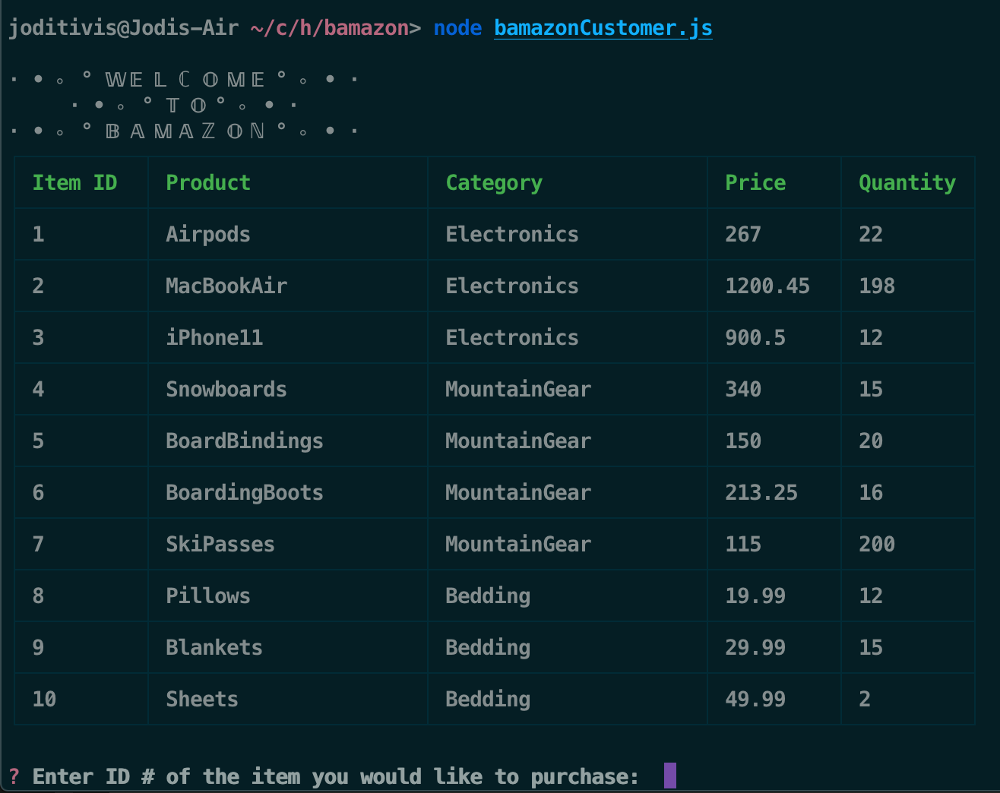
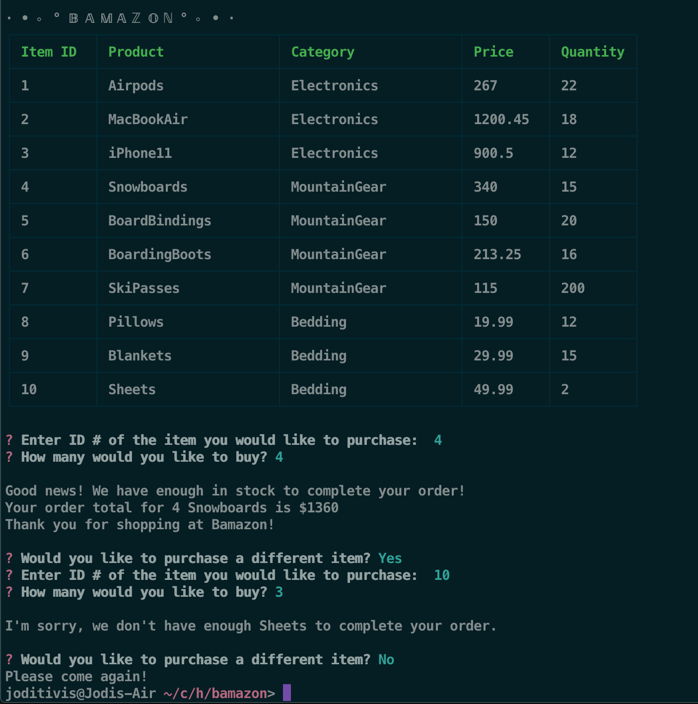

# · • ⸰ ° 𝔹 𝔸 𝕄 𝔸 ℤ 𝕆 ℕ ° ⸰ • ·

# About:
University of Denver Coding Bootcamp 12th week assignment: This assignment required us to create an Amazon type app called Bamazon using MySQL and Node.js

# How It Works:
- Bamazon displays products for sale, prompts users for which item they would like to purchase and how many.
- If the store has the amount in stock, it will let the user know their order is complete and the total amount spent.
- If there is an insufficient amount of an item, the app will let the user know Bamazon does not have enough in stock to complete their order and will then ask them if they would like to purchase a different item.

# Tools + Languages Used:
* JavaScript
* Node.js
* MySQL

# App Functionality:
## Starting the application:

## Completing an Order:
* Enter in the item ID
* Enter in the amount to purchase
* App returns order confirmation and order total
* App asks customer if they would like to purchase a different item
* Customer selects Yes or No
* If yes, app prompts customer again for which item they would like to purchase
* If no, app returns message saying "Please come again!" and ends session

## Insufficient Amount of Product:
* Enter in the item ID
* Enter in the amount to purchase
* App returns message letting customer know there is not enough of that item in stock
* App asks customer if they would like to purchase a different item
* Customer selects Yes or No
* If yes, app prompts customer again for which item they would like to purchase
* If no, app returns message saying "Please come again!" and ends session

# Screenshots

